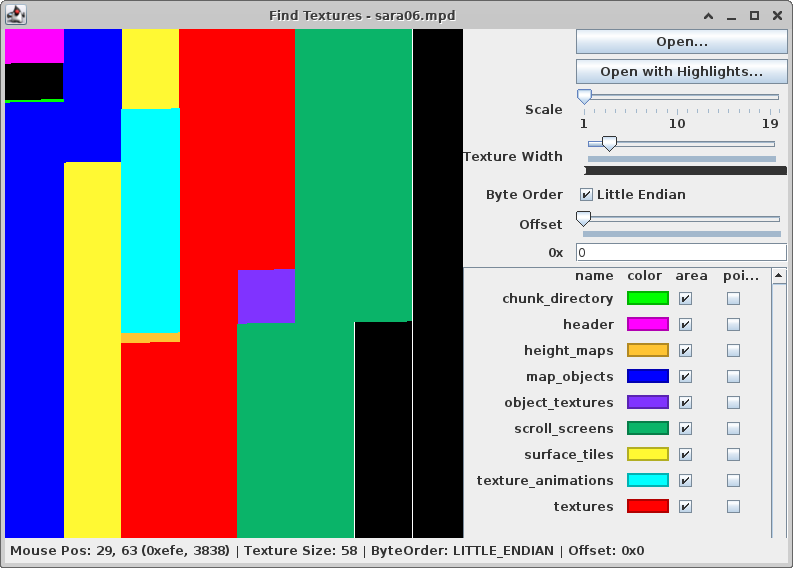
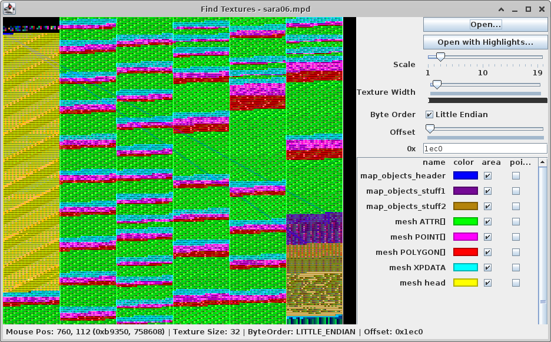
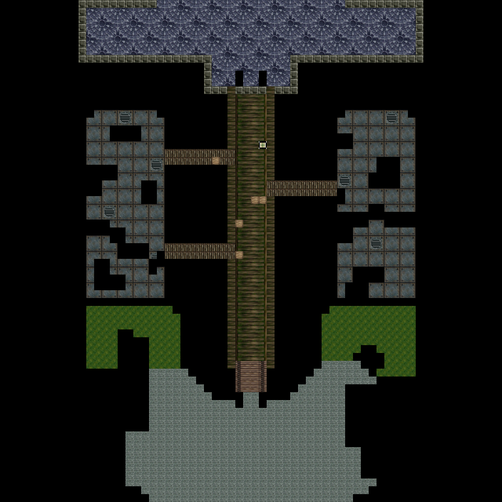
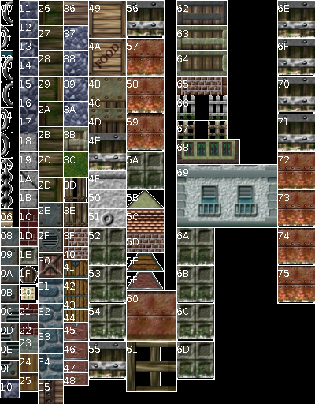
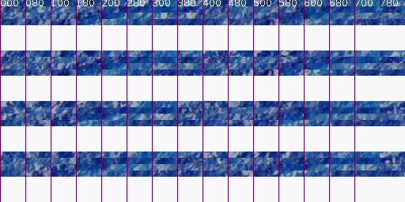
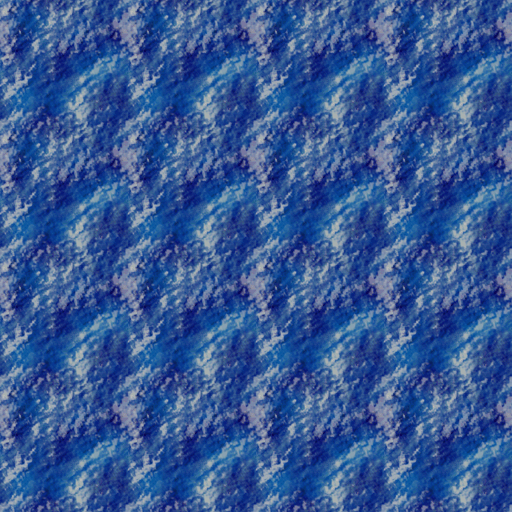
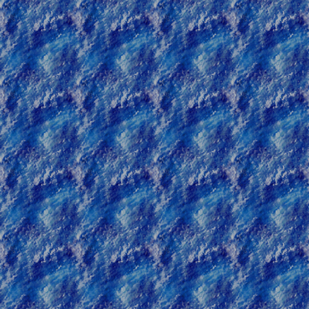
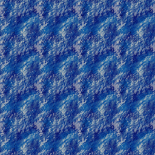
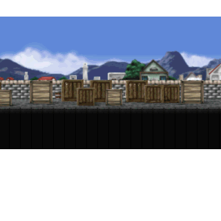

# Description

The mpd files (Map Data) contain the 3d map data for normal travel and battle. Maps consist of

* static meshes like buildings, trees
* movable or interactible meshes like barrels and chests
* surface model (normals, textures, rendered heightmap)
* textures and animated textures
* skybox images
* heightmap with textures
* rotating scrolls used as ground (i.e. water)
* surface tiles (heightmap/walkmesh, terrain types, event IDs)
* lighting data (direction, palette)
* camera and battle boundaries

Data for individual battles are stored in the X1BTL\*.BIN files.

The file is split in a header, which is always loaded to 0x290000, and a list of chunks. The individual chunks are
mostly compressed and are loaded to individual memory locations depending on the content.

# File Structure

| Offset | Name        | Type       | Count              | Description                                                                      |
|--------|-------------|------------|--------------------|----------------------------------------------------------------------------------|
| 0x0000 | header      | Header     | 1                  | File header. See description in Chapter [Header](#header)                        |
| 0x2000 | chunk_table | ChunkTable | 1                  | Table with chunk offsets and sized. See description in Chapter [Chunks](#chunks) |
| 0x2100 | chunks      | Chunk[]    | 0..211) | At most 21 chunks. See description in Chapter [Chunks](#chunks)                  |

1) Note that in Scenario 1 there are only 19 chunks and in scenario 2, 3, and Premium Disk are 21 chunks.

# Header

The total header size is always 0x2000 bytes. Unused bytes are padded with zero.

## File header

Size: 12 bytes

The first int32 in the file is an offset to a sub header, which contains just another offset to the final header.

| Offset | Name    | Type  | Count | Description                                     |
|--------|---------|-------|-------|-------------------------------------------------|
| 0x00   | offset1 | int32 | 1     | first header indirection. pointer to sub header |
| 0x04   |         | int32 | 2     | zero (0x0). padding?                            |

## Sub Header

Size: 4 bytes

Just an offset to the final header.

| Offset | Name    | Type  | Count | Description                                          |
|--------|---------|-------|-------|------------------------------------------------------|
| 0x00   | offset2 | int32 | 1     | second header indirection. pointer to sub sub header |

## Sub Sub Header

Size:  0x58 (88) bytes

This is the main header. In Sc3 and PD there is another palette (`offset_pal_3`) entry.

| Offset Sc1/Sc21) | Offset Sc3/PD2) | Name                            | Type  | Count | Description                                                                                                                                                                                                                                                                                                                                 |
|-----------------------------|----------------------------|---------------------------------|-------|-------|---------------------------------------------------------------------------------------------------------------------------------------------------------------------------------------------------------------------------------------------------------------------------------------------------------------------------------------------|
| 0x00                        |                            | map_flags                       | int16 | 1     | Unknown. Might be map id.                                                                                                                                                                                                                                                                                                                   |
| 0x02                        |                            | padding                         | int16 | 1     | Always zero 0x0000                                                                                                                                                                                                                                                                                                                          |
| 0x04                        |                            | offsetLightPalette              | int32 | 1     | Always 0x0c. Pointer to a table of 32 16-bit colors in ABGR1555 format. (#light-palette).                                                                                                                                                                                                                                                   |
| 0x08                        |                            | offsetLightDirection            | int32 | 1     | Always 0x4c. pointer to light direction as pitch and yaw. See (#light-direction).                                                                                                                                                                                                                                                           |
| 0x0C                        |                            | offset3                         | int32 | 1     | Always 0x50. pointer to 0x20 unknown int16s at the start of the file. Mostly zero or 0x8000. (#header-offset-3)                                                                                                                                                                                                                             |
| 0x10                        |                            | view_distance                   | int16 | 1     | This seems to be something like a view distance for meshes from the models chunk. Somehow the meshes are checked if they are in the view frustrum and this field a a parameter to the view frustrum check. It is in grid coordinates (must be multiplied by 20.0). Maybe for interior rooms to limit the drawn objects to the current room. |
| 0x12                        |                            | padding                         | int16 | 1     | Always zero                                                                                                                                                                                                                                                                                                                                 |
| 0x14                        |                            | offset_model_switch_groups      | int32 | 1     | Pointer to Model Switch Group List. See [Model Switch Groups](#model-switch-groups)                                                                                                                                                                                                                                                         |
| 0x18                        |                            | offset_texture_groups           | int32 | 1     | Offset to list of texture groups. See (#texture-groups)                                                                                                                                                                                                                                                                                     |
| 0x1C                        |                            | offset6                         | int32 | 1     | Pointer to unknown list. Only used in rail1.mpd. 5 values.                                                                                                                                                                                                                                                                                  |
| 0x20                        |                            | offsetScrollScreenAnimation     | int32 | 1     | Pointer to list of KA table for scroll screen animation [Scroll Screen Animation](#scroll-screen-animation)                                                                                                                                                                                                                                 |
| 0x24                        |                            | offset_mesh_1                   | int32 | 1     | Pointer to list of 2 movable/interactable mesh. may be null.                                                                                                                                                                                                                                                                                |
| 0x28                        |                            | offset_mesh_2                   | int32 | 1     | Pointer to list of 2 movable/interactable mesh. may be null.                                                                                                                                                                                                                                                                                |
| 0x2C                        |                            | offset_mesh_3                   | int32 | 1     | Pointer to list of 2 movable/interactable mesh. may be null.                                                                                                                                                                                                                                                                                |
| 0x30                        |                            | modelsPreYrotation              | Angle | 1     | mostly 0x8000. The meshes from the models chunk are pre-rotated by this angle                                                                                                                                                                                                                                                               |
| 0x32                        |                            | modelsViewAngleMin              | Angle | 1     | mostly 0xb334. Has something to do with the view angle. more research necessary.                                                                                                                                                                                                                                                            |
| 0x34                        |                            | modelsViewAngleMax              | Angle | 1     | mostly 0x4ccc. Has something to do with the view angle. more research necessary.                                                                                                                                                                                                                                                            |
| 0x36                        |                            | padding                         | int16 | 1     | Always zero                                                                                                                                                                                                                                                                                                                                 |
| 0x38                        |                            | offset_texture_anim_alternative | int32 | 1     | Pointer to a list of texture indices. These textures are the same images as the "real" texture animations, but these textures are from the normal texture block (and doesn't seems to be used). See (#texture-animation-alternatives)                                                                                                       |
| 0x3C                        |                            | offset_pal_1                    | int32 | 1     | Pointer to 256 16-bit colors in ABGR1555 format. Scenario 1+2: May be null. Scenario 3+PD: Non-null.                                                                                                                                                                                                                                        |
| 0x40                        |                            | offset_pal_2                    | int32 | 1     | Pointer to 256 16-bit colors in ABGR1555 format. Scenario 1+2: May be null. Scenario 3+PD: Non-null.                                                                                                                                                                                                                                        |
| ----                        | 0x44                       | offset_pal_3                    | int32 | 1     | (see note) Pointer to 256 colors in ABGR1555 format. Non-null.                                                                                                                                                                                                                                                                              |
| 0x44                        | 0x48                       | scroll_screen_x                 | int16 | 1     | X Pos of scroll screen                                                                                                                                                                                                                                                                                                                      |
| 0x46                        | 0x4a                       | scroll_screen_y                 | int16 | 1     | Y Pos of scroll screen                                                                                                                                                                                                                                                                                                                      |
| 0x48                        | 0x4c                       | scroll_screen_z                 | int16 | 1     | Z os of scroll screen.                                                                                                                                                                                                                                                                                                                      |
| 0x4a                        | 0x4e                       | scroll_screen_angle             | Angle | 1     | Yaw angle (X) of scroll screen                                                                                                                                                                                                                                                                                                              |
| 0x4C                        | 0x50                       | unknown_4c                      | int16 | 1     | Unknown. Looks like a map coordinate                                                                                                                                                                                                                                                                                                        |
| 0x4E                        | 0x52                       | background_scroll_x             | int16 | 1     | X Coordinate for background scroll screen.                                                                                                                                                                                                                                                                                                  |
| 0x50                        | 0x54                       | background_scroll_y             | int16 | 1     | Y Coordinate for background scroll screen.                                                                                                                                                                                                                                                                                                  |
| 0x52                        | 0x56                       | padding                         | int16 | 1     | padding, always zero                                                                                                                                                                                                                                                                                                                        |
| 0x54                        | 0x58                       | offsetBoundaries                | int32 | 1     | Pointer to boundaries for the camera and battle map. See [Boundaries](#boundaries)                                                                                                                                                                                                                                                          |

1) Offset for Sc1 and Sc2. The field  `offset_pal_3` does not exist in Sc1/Sc2
2) Offset for Sc3 and PD (when different from Sc1/Sc2).

## Light Palette

This is a color palette with 0x20 entries used for lighting, sorted from darkest to lightest. Each value is a 16-bit
color in ABGR1555
format. The alpha bit is always zero.

| Offset | Name      | Type   | Count | Description         |
|--------|-----------|--------|-------|---------------------|
| 0x00   | light_pal | uint16 | 0x20  | Light palette Color | 

## Light Direction

| Offset | Name  | Type   | Count | Description                                                                                    |
|--------|-------|--------|-------|------------------------------------------------------------------------------------------------|
| 0x00   | pitch | uint16 | 1     | Pitch of the light direction (X/Z rotation). See the table below for values and their meaning. |
| 0x02   | yaw   | uint16 | 1     | Yaw of the light direction (Y rotation). See the table below for values and their meaning.     |

### Pitch Values

| Value  | Meaning                                     | Lighting effect                                                    |
|--------|---------------------------------------------|--------------------------------------------------------------------|
| 0x0000 | Light points forward (north at yaw 0x0000)  | A bit dark, anything with less than a 45 degree slope is very dark |
| 0x4000 | Light points up                             | Completely dark 1)                                      |
| 0x8000 | Light points backward (south at yaw 0x0000) | A bit dark, anything less than 45 degree slope is very dark        |
| 0xC000 | Light points down                           | Completely bright1)                                     |

The value 0x9970 is typically used for outside lighting.

1) This is based on the typical outside light palette. It is not known if brightness differs depending on the palette
   used.

### Yaw Values

(The X/Z direction of the light flips when the pitch is > 0x4000 and < 0xC000)

| Value  | Meaning, Pitch > 0xC000 \|\| < 0x4000 | Meaning, Pitch > 0x4000 && < 0xC000 |
|--------|---------------------------------------|-------------------------------------|
| 0x0000 | Light points north                    | Light points south                  |
| 0x4000 | Light points east                     | Light points west                   |
| 0x8000 | Light points south                    | Light points north                  |
| 0xC000 | Light points west                     | Light points east                   |

## Header Offset 3

This list contains exactly 16 int32 or 32 int16 values. The purpose is unknown.

This list is most often filled with zeros.

## Model Switch Groups

This list contains model groups which can be switched by setting or clearing a game flag.
`trigger_flag` is the in game trigger id which can be set or cleared, the `trigger_state` is 0x0 (`false`).
When the flag is set, the game enables the models from the `enabledModelsOffset` list and disables the models from the
`disabledModelsOffset`. Then the `trigger_state` is set to `true` and the `enabledModelsOffset`
and `disabledModelsOffset` lists are swapped.

The Group ends when `trigger_flag` is -1;

Size of one list item: 16 bytes

| Offset | Name                 | Type  | Count | Description                                                         |
|--------|----------------------|-------|-------|---------------------------------------------------------------------|
| 0x00   | trigger_flag         | int32 | 1     | Unknown small value. 0xffff when the list is finished.              |
| 0x04   | enabledModelsOffset  | int32 | 1     | Pointer to list of uint16 values. The list is terminated by 0xffff. |
| 0x08   | disabledModelsOffset | int32 | 1     | Pointer to list of uint16 values. The list is terminated by 0xffff. | 
| 0x0C   | trigger_state        | int32 | 1     | Unknown value, mostly zero.                                         |

## Texture Groups

This is a list of texture groups which themselves have a list of the textures for the animation.
The end of the texture group list is marked by 0xffff (texture_group = 0xffff).

### Scenario 1 and 2

| Offset | Name           | Type                           | Count | Description                                |
|--------|----------------|--------------------------------|-------|--------------------------------------------|
| 0x00   | texture_group  | int16                          | 1     | Texture number for SGL.                    |
| 0x02   | texture_width  | int16                          | 1     | width of textures in this group            |
| 0x04   | texture_height | int16                          | 1     | height of textures in this group           |
| 0x06   |                | int16                          | 1     | unknown small value. maybe animation speed |
| 0x08   | frames[]       | [TextureFrame](#texture-frame) | ?     | List of Texture Animation Frames.          |

### Scenario 3 and Premium Disk

| Offset | Name           | Type                           | Count | Description                                |
|--------|----------------|--------------------------------|-------|--------------------------------------------|
| 0x00   | texture_group  | int32                          | 1     | Texture number for SGL.                    |
| 0x04   | texture_width  | int32                          | 1     | width of textures in this group            |
| 0x08   | texture_height | int32                          | 1     | height of textures in this group           |
| 0x0C   |                | int32                          | 1     | unknown small value. maybe animation speed |
| 0x10   | frames[]       | [TextureFrame](#texture-frame) | ?     | List of Texture Animation Frames.          |        

## Texture Frame

Size: 4/8\* bytes

List of textures in the animation. The offsets point into the
*compressed* data, only one texture image is compressed in this entry.
The end of the list is marked by an offset of 0xfffe (0xfffffffe for Scenario 3 / Premium Disk).

### Scenario 1 and 2

| Offset | Name   | Type   | Count | Description                                                           |
|--------|--------|--------|-------|-----------------------------------------------------------------------|
| 0x00   | offset | uint16 | 1     | offset into compressed data                                           |
| 0x02   | count  | uint16 | 1     | the number of in-game frames this animation frame is active, at 30fps |

### Scenario 3 and Premium Disk

| Offset | Name   | Type   | Count | Description                                                           |
|--------|--------|--------|-------|-----------------------------------------------------------------------|
| 0x00   | offset | uint32 | 1     | offset into compressed data                                           |
| 0x04   | count  | uint32 | 1     | the number of in-game frames this animation frame is active, at 30fps |

## Scroll Screen Animation

This table is used to animate the rotation scroll screen. In sc1 this is only used in saraband (sara02, sara03, sara04).

Experimental: it seems that this is the scroll map configuration (see [2] page 8-21, `void sl1MapRA (void *map_a);`).
Note that the scroll map for rotating scrolls is always 4x4.

The list is finished when the first value in the item is 0xffff.

List item size: 0x11 * uint16 (0x22)

| Offset | Name           | Type   | Count | Description                                       |
|--------|----------------|--------|-------|---------------------------------------------------|
| 0x00   | plane_index    | uint16 | 16    | 4x4 values which plane should be used for the map |
| 0x20   | frames_to_hold | uint15 | 1     | number of frames to hold the animation            |

## Boundaries

Size: 18 bytes

Boundaries for the camera position and battle map are stored as a box with (X1, Y1) and (X2, Y2) coordinates.

Each coordinate is a *world coordinate*, rather than a *tile coordinate*. Each tile spans 32 world coordinates, with the
tile center offset by (+16, +16).

For example: The center of tile (10, 20) would be at coordinate (336, 656), or (10\*32+16, 20\*32+16).

The battle boundary affects which tiles are selectable during battle and the dimensions of the viewable battle map.

| Offset | Name       | Type  | Count | Description                         |
|--------|------------|-------|-------|-------------------------------------|
| 0x00   | camera\_x1 | int16 | 1     | X1 coordinate for camera bounds     |
| 0x02   | camera\_y1 | int16 | 1     | Y1 coordinate for camera bounds     |
| 0x04   | camera\_x2 | int16 | 1     | X2 coordinate for camera bounds     |
| 0x06   | camera\_y2 | int16 | 1     | Y2 coordinate for camera bounds     |
| 0x08   | battle\_x1 | int16 | 1     | X1 coordinate for battle map bounds |
| 0x0A   | battle\_y1 | int16 | 1     | Y1 coordinate for battle map bounds |
| 0x0C   | battle\_x2 | int16 | 1     | X2 coordinate for battle map bounds |
| 0x0E   | battle\_y2 | int16 | 1     | Y2 coordinate for battle map bounds |

## Movable or interactible objects

Size: 0x1c (28) bytes

The objects list contains meshes for barrels, chest and crates. The end of the list is marked by 0x0.
Sometimes the data is in the file, but the pointer in the header is null, so it is "dangling".

| Offset | Name            | Type   | Count | Description                                          |
|--------|-----------------|--------|-------|------------------------------------------------------|
| 0x00   | offset_polydata | PDATA* | 1     | pointer to PDATA (see SGL)                           |
| 0x04   | position        | int16  | 3     | Integer part of the position. Decimal part is 0x0000 |
| 0x0A   | rotation        | ANGLE  | 3     | Rotation of the mesh.                                |
| 0x10   | scale           | FIXED  | 3     | Scale of the mesh.                                   |

## Texture animation alternatives

The 16-bit integers in this list are texture indices, the end of the list is marked by 0xffff. The referenced texture
images are similar to the ones which are in the [texture animation images](#texture-animation-images) chunk, but these
textures are from the "normal" [texture chunk](#texture-chunk).
The image indices are in one list without a separator, so it is not visible which image belongs to which texture group.

This list is used to quickly check if a texture id is part of an animated texture.

# Chunks

Chunks are memory blocks which may be compressed and are placed in specific memory locations, depending on the content.
The chunks are always in the same order, but not all files need all chunk types.

| Chunk Index | Name                     | Description                                                                                                                                                 |
|-------------|--------------------------|-------------------------------------------------------------------------------------------------------------------------------------------------------------|
| 0           | empty_1                  | This chunk always seem to be empty (size 0).                                                                                                                |
| 1           | static_meshes            | [Static map objects](#static-meshes). Mesh data and position/rotation/scale.                                                                                |
| 2           | surface                  | Surface textures, surface normals, and heightmaps for models. Sometimes this is empty in Scenario 2 onward, but present in chunk 20 (see #chunks-20-and-21) |
| 3           | texture_animation_images | Images for animated textures. Each image is individually compressed.                                                                                        |
| 4           | empty_2                  | This chunk always seem to be empty (size 0).                                                                                                                |
| 5           | surface_meshes           | Heightmap for each surface tile and some unknown surface attributes. Might be walkmesh and movement costs. The chunk is compressed.                         |
| 6 - 10      | textures                 | Texture images. The chunks are compressed.                                                                                                                  |
| 11 - 13     | object_textures          | Textures for movable objects (see [Header](#header)). The chunks are compressed.                                                                            |
| 14 - 19     | scroll_panes             | Memory blocks for scroll panes (skybox) and rotating scrolls (ground). The chunks are compressed.                                                           |
| 20\*        | alt. surface or unknown  | \nIf Chunk 2 is empty, sometimes the surface model data is located here. However, this is sometimes used for other unknown data (see #chunks-20-and-21)     |
| 21\*        | unknown                  | \*Unknown chunk data.                                                                                                                                       |

_\* Only in Scenario 2, 3, and Premimum Disk_

## Compressed Streams

Some Chunks use some kind of LZ77 compression.

The chunk is divided in "lines", which consists of an int16 "control" and
16 int16s data. One bit in control corresponds to one int16 of the data,
starting with the msb of control. Cleared bit in control means "data int16",
set bit in control means "command int16".

## Chunk Table

Size: 32 * 8 bytes (256 Bytes)

Always starts at offset 0x2000. The table only contains the offsets and the sizes. Unused chunks have the offset
of the next chuck (the offset of the next free location in the file) and a size of zero. Chunks without a meaning
for the scenario have both an address and size of zero.

The first chunk starts at 0x2100. As the first chunk is always [static meshes](#static-meshes), this is the chunk at
0x2100.

| Offset | Name       | Type     | Count | Description                     |
|--------|------------|----------|-------|---------------------------------|
| 0x00   | chunk_item | offset[] | 32    | offsets and sizes of the chunk. |

## Chunk Item

Size: 8 bytes

| Offset | Name   | Type  | Count | Description     |
|--------|--------|-------|-------|-----------------|
| 0x0    | offset | int32 | 1     | offset to chunk |
| 0x4    | size   | int32 | 1     | size of chunk   |   

# Static Meshes (Chunk 1)

Describes the static meshes in the maps. These are mostly buildings, fences, trees and similar. Some maps use static
meshes for floor tiles too.

Note: This whole file is normally loaded to 0x290000, so this chunk will be at offset 0x292100 and all offsets in this
chunk are relative to 0x292100. In some maps only this chunk is loaded to 0x60a0000, so you have to adjust the
logic to make these offsets relative to the file.

## Structure

The chunk consists of the header with the mesh list and the PDATA structures. The order of the PDATA list is: PDATA,
list of POINTs, list of POLYGONs and list of polygon ATTRs.

## Mesh header

| Offset | Name                     | Type   | Count      | Description                                  |
|--------|--------------------------|--------|------------|----------------------------------------------|
| 0x00   | offset_collision_segment | int32  | 1          | Offset to CollisionSegments header.          |
| 0x04   | offset_collision_tiles   | int32  | 1          | offset to collision tile table. May be null. |
| 0x08   | num_meshes               | int16  | 1          | number of objects                            |
| 0x0A   |                          | int16  | 1          | padding, 0x00                                |
| 0x0C   | meshes[]                 | Mesh[] | num_meshes | for each mesh a [Mesh](#mesh) structure.     |

## CollisionSegments

| Offset | Name                 | Type  | Count | Description                               |
|--------|----------------------|-------|-------|-------------------------------------------|
| 0x00   | offset_points        | int32 | 1     | Offset to list of ShortPoint2D.           |
| 0x04   | offset_line_segments | int32 | 1     | offset to list of collision line segments |

## ShortPoint2D

List of 2d points for the collision lines. There is no size or count. To get the number of points, you have to
read the list if Collision Line Segments and find the point with the highest point id.

| Offset | Name | Type  | Count | Description                      |
|--------|------|-------|-------|----------------------------------|
| 0x00   | x    | int16 | 1     | x coordinate, integer part only. |
| 0x02   | y    | int16 | 1     | y coordinate, integer part only. |

## Collision Line Segment

The lines connect two points. The angle rotates the line so the exterior is down.
The unknown field is used (there are some values), but the purpose is unknown.

There is no size or count field. You have to read all collision tiles to get the highest line segment id and therefore
the size if the list.

| Offset | Name       | Type  | Count | Description                        |
|--------|------------|-------|-------|------------------------------------|
| 0x00   | leftPoint  | int16 | 1     | Index of first point of the line.  |
| 0x02   | rightPoint | int16 | 1     | Index of second point of the line. |
| 0x04   | angle      | int16 | 1     | angle of the line                  |
| 0x06   | unknown    | int16 | 1     | unknown                            |

## Collision Tiles

This is a list of 256 offsets to list of shorts. Each list corresponds to a tile of the map. The shorts are collision
line segment indices, terminated by 0xffff.

Each tile has the line segments which would be present in this tile and all line segments from the neighbouring tiles.
This is most likely a performance optimization, so that the collision detection only needs to check the line segments in
the vicinity of the player.

| Offset | Name       | Type  | Count | Description                        |
|--------|------------|-------|-------|------------------------------------|
| 0x00   | leftPoint  | int16 | 1     | Index of first point of the line.  |
| 0x02   | rightPoint | int16 | 1     | Index of second point of the line. |
| 0x04   | angle      | int16 | 1     | angle of the line                  |
| 0x06   | unknown    | int16 | 1     | unknown                            |

## Mesh

Size: 0x3C (60) bytes

Each mesh consists of the transform (translation, rotation, scale) and up to 8 polygon meshes.
TODO: this might be some kind of level-of-detail.

Note: for PDATA see SGL Reference.

| Offset | Name            | Type     | Count | Description                                                                                                |
|--------|-----------------|----------|-------|------------------------------------------------------------------------------------------------------------|
| 0x00   | pdata_offsets[] | int32    | 8     | 8 offsets to #PDATA structures. These pdata points to the same mesh and different face attributes (#ATTR). |
| 0x20   | position        | int16[3] | 1     | position of the mesh in x,y,z. Only the integer part.                                                      |
| 0x26   | rotation        | ANGLE[3] | 1     | rotation of the mesh in SGL ANGLE.                                                                         |
| 0x2C   | scale           | FIXED[3] | 1     | scale of the mesh                                                                                          |
| 0x38   | objectId        | uint16   | 1     | id to identify a mesh. note that the id need not to be unique, 2 meshes can have the same id               |
| 0x3A   | flags           | uint16   | 1     | mesh flags                                                                                                 |

Known mesh flags:

* 0x10 - looks like this flag hides the object.
* 0x08 - always face camera
* 0x07 - 8 view angles, don't know how they are used.

## Static Objects Offset1

| Offset | Name    | Type  | Count | Description                                                                    |
|--------|---------|-------|-------|--------------------------------------------------------------------------------|
| 0x00   | offset1 | int32 | 1     | offset to list of ints. size of the list is unknown.                           |
| 0x04   | offset2 | int32 | 1     | offset to list of two ints each. size seems to be the same the list at offset1 |

Note:
In the list behind offset2 the first int contains strictly ascending values in the first 16 bits and the last 16 bits.

Example sara06.json:

    "stuff_at_offset_1": {
      "offset_1": "0x113f4 (raw: 0x2a13f4)",
      "offset_2": "0x11570 (raw: 0x2a1570)",
      "count_1": 95,
      "count_1_hex": "0x5f",
      "values_1": [
        "0x39f015f",
        "0x3a0025f",
        "0x29d0262",
        "0x29b0207",
        "0x25d01c7",
        "0x1a301c6",
        "0x1660203",
        "0x164029a",
        "0x1e4029b",
        "0x1e402e3",
        ...
        "0x3de0401",
        "0x3de041e",
        "0x38202a0",
        "0x3800280",
        "0x3610280",
        "0x361029e"
      ],
      "count_2": 93,
      "count_2_hex": "0x5d",
      "values_2": [
        "0x1 0x7fbe1c00",
        "0x4c 0x41c34b00",
        "0x10002 0xbf871b00",
        "0x20003 0xff6b1a00",
        "0x30004 0xe0a51900",
        "0x40005 0xc0321800",
        "0x50006 0x9fdd1700",
        "0x60007 0x807c1600",
        "0x70008 0x40711500",
        "0x80009 0x80391400",
        "0x9000a 0xbfcf1300",
        "0xa000b 0x80421200",
        "0xb000c 0xbfaf1100",
        "0xc000d 0x805d1000",
        "0xd000e 0x406c0f00",
        "0xe000f 0x7d290e00",
        "0xf0010 0x41610d00",
        ...
        "0x500051 0x7f7a5000",
        "0x510052 0x3f7a4f00",
        "0x530054 0x40215200",
        "0x540055 0x7ee55300",
        "0x550056 0xc0bf5400",
        "0x57005a 0x3f705700",
        "0x570058 0xff735800",
        "0x580059 0x40685500",
        "0x59005a 0x80b35600",
        "0x5b005c 0xfe1a5c00",
        "0x5c005d 0xc0635b00",
        "0x5d005e 0x80005a00"
      ]
    },

## Static Objects Offset2

| Offset | Name   | Type  | Count | Description                                               |
|--------|--------|-------|-------|-----------------------------------------------------------|
| 0x00   | offset | int32 | 256   | list of 256 offsets which each point to a list of shorts. |

List of shorts:

| Offset | Name       | Type  | Count | Description                    |
|--------|------------|-------|-------|--------------------------------|
| 0x00   | value      | int16 | ?     | small unknown short            |
| ??     | end_marker | int16 | 1     | 0xFFFF. Marks the end of list. |

These list form some kind of triangles (see example). A very wild guess might be some kind of
[BSP Tree](https://en.wikipedia.org/wiki/Binary_space_partitioning) to detect meshes which doesn't need to be drawn.

Example sara06.json:

    "stuff_at_offset_2": {
      "size": 256,
      "offsets": {
        "0x11c58": "[]",
        "0x11c5a": "[]",
        "0x11c5c": "[]",
        "0x11c5e": "[]",
        "0x11c60": "[]",
        "0x11c62": "[]",
        "0x11c64": "[]",
        "0x11c66": "[]",
        "0x11c68": "[]",
        "0x11c6a": "[]",
        "0x11c6c": "[]",
        "0x11c6e": "[]",
        "0x11c70": "[]",
        "0x11c72": "[]",
        "0x11c74": "[]",
        "0x11c76": "[]",
        "0x11c78": "[]",
        "0x11c7a": "[]",
        "0x11c7c": "[]",
        "0x11c7e": "[]",
        "0x11c80": "[]",
        "0x11c82": "[]",
        "0x11c84": "[]",
        "0x11c86": "[0x4e, 0x4f]",
        "0x11c8c": "[0x4e, 0x4f]",
        "0x11c92": "[]",
        "0x11c94": "[]",
        "0x11c96": "[]",
        "0x11c98": "[]",
        "0x11c9a": "[]",
        "0x11c9c": "[]",
        "0x11c9e": "[]",
        "0x11ca0": "[]",
        "0x11ca2": "[]",
        "0x11ca4": "[]",
        "0x11ca6": "[]",
        "0x11ca8": "[]",
        "0x11caa": "[]",
        "0x11cac": "[0x0, 0x1]",
        "0x11cb2": "[0x0, 0x1, 0x2d, 0x4e, 0x4f]",
        "0x11cbe": "[0x1, 0x2c, 0x2d, 0x4e, 0x4f]",
        "0x11cca": "[0x2c, 0x2d]",
        "0x11cd0": "[]",
        "0x11cd2": "[]",
        "0x11cd4": "[]",
        "0x11cd6": "[]",
        "0x11cd8": "[]",
        "0x11cda": "[]",
        "0x11cdc": "[]",
        "0x11cde": "[]",
        "0x11ce0": "[0x5, 0x6, 0x7, 0x2a, 0x2b]",
        "0x11cec": "[0x5, 0x6, 0x7, 0x2a, 0x2b]",
        "0x11cf8": "[0x3, 0x4, 0x5, 0x28, 0x2b]",
        "0x11d04": "[0x3, 0x4, 0x5, 0x28, 0x2b]",
        "0x11d10": "[0x0, 0x1]",
        "0x11d16": "[0x0, 0x1, 0x2d, 0x4e, 0x4f]",
        "0x11d22": "[0x1, 0x2c, 0x2d, 0x4e, 0x4f]",
        "0x11d2e": "[0x2c, 0x2d]",
        "0x11d34": "[0x31, 0x32, 0x33, 0x34, 0x35]",
        "0x11d40": "[0x31, 0x32, 0x33, 0x34, 0x35]",
        "0x11d4c": "[0x35, 0x36, 0x37]",
        "0x11d54": "[0x35, 0x36, 0x37]",
        "0x11d5c": "[]",
        "0x11d5e": "[]",
        "0x11d60": "[]",
        "0x11d62": "[]",
        "0x11d64": "[0x5, 0x6, 0x7, 0x8, 0x29, 0x2a, 0x2b]",
        "0x11d74": "[0x5, 0x6, 0x7, 0x8, 0x9, 0x29, 0x2a, 0x2b]",
        "0x11d86": "[0x2, 0x3, 0x4, 0x5, 0x8, 0x9, 0x20, 0x23, 0x28, 0x29, 0x2b]",
        "0x11d9e": "[0x2, 0x3, 0x4, 0x5, 0x20, 0x23, 0x28, 0x29, 0x2b]",
        "0x11db2": "[0x0, 0x2, 0x21, 0x22, 0x23, 0x5a, 0x5b, 0x5c]",
        "0x11dc4": "[0x0, 0x2, 0x21, 0x22, 0x23, 0x5a, 0x5b, 0x5c]",
        "0x11dd6": "[0x2c]",
        "0x11dda": "[0x2c]",
        "0x11dde": "[0x2f, 0x30, 0x31, 0x32, 0x33, 0x34, 0x35]",
        "0x11dee": "[0x2f, 0x30, 0x31, 0x32, 0x33, 0x34, 0x35, 0x4a, 0x4b, 0x4c, 0x4d]",
        "0x11e06": "[0x35, 0x36, 0x37, 0x49, 0x4a, 0x4b, 0x4c, 0x4d]",
        "0x11e18": "[0x35, 0x36, 0x37, 0x49, 0x4a]",
        "0x11e24": "[]",
        "0x11e26": "[]",
        "0x11e28": "[]",
        "0x11e2a": "[]",
        "0x11e2c": "[0x7, 0x8, 0xa, 0xb, 0xc, 0xd, 0x29, 0x2a]",
        "0x11e3e": "[0x7, 0x8, 0x9, 0xa, 0xb, 0xc, 0xd, 0x26, 0x27, 0x29, 0x2a]",
        "0x11e56": "[0x2, 0x3, 0x8, 0x9, 0xa, 0x20, 0x23, 0x24, 0x26, 0x27, 0x28, 0x29]",
        "0x11e70": "[0x2, 0x3, 0x20, 0x23, 0x24, 0x27, 0x28, 0x29]",
        "0x11e82": "[0x0, 0x2, 0x21, 0x22, 0x23, 0x5a, 0x5b, 0x5c]",
        "0x11e94": "[0x0, 0x2, 0x21, 0x22, 0x23, 0x50, 0x51, 0x52, 0x5a, 0x5b, 0x5c]",
        "0x11eac": "[0x2c, 0x2e, 0x3e, 0x3f, 0x50, 0x51, 0x52]",
        "0x11ebc": "[0x2c, 0x2e, 0x3e, 0x3f]",
        "0x11ec6": "[0x2e, 0x2f, 0x30, 0x31, 0x3b, 0x3c, 0x3d, 0x3e]",
        "0x11ed8": "[0x2e, 0x2f, 0x30, 0x31, 0x3b, 0x3c, 0x3d, 0x3e, 0x44, 0x45, 0x46, 0x48, 0x4a, 0x4b, 0x4c, 0x4d]",
        "0x11efa": "[0x37, 0x44, 0x45, 0x46, 0x48, 0x49, 0x4a, 0x4b, 0x4c, 0x4d]",
        "0x11f10": "[0x37, 0x48, 0x49, 0x4a]",
        "0x11f1a": "[]",
        "0x11f1c": "[]",
        "0x11f1e": "[]",
        "0x11f20": "[]",
        "0x11f22": "[0xa, 0xb, 0xc, 0xd, 0xe]",
        "0x11f2e": "[0x9, 0xa, 0xb, 0xc, 0xd, 0xe, 0xf, 0x10, 0x11, 0x25, 0x26, 0x27]",
        "0x11f48": "[0x9, 0xa, 0xe, 0xf, 0x10, 0x11, 0x20, 0x24, 0x25, 0x26, 0x27]",
        "0x11f60": "[0x20, 0x24, 0x25, 0x27]",
        "0x11f6a": "[0x21]",
        "0x11f6e": "[0x21, 0x50, 0x51, 0x52, 0x53, 0x54, 0x55]",
        "0x11f7e": "[0x2c, 0x2e, 0x3e, 0x3f, 0x50, 0x51, 0x52, 0x53, 0x54, 0x55]",
        "0x11f94": "[0x2c, 0x2e, 0x3e, 0x3f]",
        "0x11f9e": "[0x2e, 0x2f, 0x39, 0x3a, 0x3b, 0x3c, 0x3d, 0x3e, 0x47]",
        "0x11fb2": "[0x2e, 0x2f, 0x38, 0x39, 0x3a, 0x3b, 0x3c, 0x3d, 0x3e, 0x44, 0x45, 0x46, 0x47, 0x48, 0x4d]",
        "0x11fd2": "[0x37, 0x38, 0x44, 0x45, 0x46, 0x47, 0x48, 0x49, 0x4d]",
        "0x11fe6": "[0x37, 0x38, 0x48, 0x49]",
        "0x11ff0": "[]",
        "0x11ff2": "[]",
        "0x11ff4": "[]",
        "0x11ff6": "[]",
        "0x11ff8": "[0xd, 0xe]",
        "0x11ffe": "[0xd, 0xe, 0xf, 0x10, 0x11, 0x12, 0x25, 0x26]",
        "0x12010": "[0xe, 0xf, 0x10, 0x11, 0x12, 0x13, 0x14, 0x15, 0x16, 0x17, 0x18, 0x1f, 0x20, 0x24, 0x25, 0x26]",
        "0x12032": "[0x12, 0x13, 0x14, 0x15, 0x16, 0x17, 0x18, 0x1f, 0x20, 0x24, 0x25]",
        "0x1204a": "[0x18, 0x19, 0x1f, 0x21]",
        "0x12054": "[0x18, 0x19, 0x1f, 0x21, 0x53, 0x54, 0x55, 0x56, 0x57, 0x58, 0x59]",
        "0x1206c": "[0x3f, 0x53, 0x54, 0x55, 0x56, 0x57, 0x58, 0x59]",
        "0x1207e": "[0x3f]",
        "0x12082": "[0x39, 0x3a, 0x3b, 0x47]",
        "0x1208c": "[0x38, 0x39, 0x3a, 0x3b, 0x44, 0x46, 0x47]",
        "0x1209c": "[0x37, 0x38, 0x44, 0x46, 0x47]",
        "0x120a8": "[0x37, 0x38]",
        "0x120ae": "[]",
        "0x120b0": "[]",
        "0x120b2": "[]",
        "0x120b4": "[]",
        "0x120b6": "[]",
        "0x120b8": "[0x11, 0x12]",
        "0x120be": "[0x11, 0x12, 0x13, 0x14, 0x15, 0x16, 0x17, 0x18, 0x1f, 0x20]",
        "0x120d4": "[0x12, 0x13, 0x14, 0x15, 0x16, 0x17, 0x18, 0x1f, 0x20]",
        "0x120e8": "[0x18, 0x19, 0x1f, 0x21]",
        "0x120f2": "[0x18, 0x19, 0x1f, 0x21, 0x56, 0x57, 0x58, 0x59]",
        "0x12104": "[0x3f, 0x56, 0x57, 0x58, 0x59]",
        "0x12110": "[0x3f]",
        "0x12114": "[]",
        "0x12116": "[]",
        "0x12118": "[]",
        "0x1211a": "[]",
        "0x1211c": "[]",
        "0x1211e": "[]",
        "0x12120": "[]",
        "0x12122": "[]",
        "0x12124": "[]",
        "0x12126": "[]",
        "0x12128": "[]",
        "0x1212a": "[]",
        "0x1212c": "[0x19]",
        "0x12130": "[0x19]",
        "0x12134": "[0x3f]",
        "0x12138": "[0x3f]",
        "0x1213c": "[]",
        "0x1213e": "[]",
        "0x12140": "[]",
        "0x12142": "[]",
        "0x12144": "[]",
        "0x12146": "[]",
        "0x12148": "[]",
        "0x1214a": "[]",
        "0x1214c": "[]",
        "0x1214e": "[]",
        "0x12150": "[]",
        "0x12152": "[]",
        "0x12154": "[0x19]",
        "0x12158": "[0x19]",
        "0x1215c": "[0x3f]",
        "0x12160": "[0x3f]",
        "0x12164": "[]",
        "0x12166": "[]",
        "0x12168": "[]",
        "0x1216a": "[]",
        "0x1216c": "[]",
        "0x1216e": "[]",
        "0x12170": "[]",
        "0x12172": "[]",
        "0x12174": "[]",
        "0x12176": "[]",
        "0x12178": "[]",
        "0x1217a": "[]",
        "0x1217c": "[0x19, 0x1a, 0x1b, 0x1c]",
        "0x12186": "[0x19, 0x1a, 0x1b, 0x1c, 0x1d, 0x40, 0x41, 0x42, 0x43]",
        "0x1219a": "[0x1c, 0x1d, 0x3f, 0x40, 0x41, 0x42, 0x43]",
        "0x121aa": "[0x3f, 0x40]",
        "0x121b0": "[]",
        "0x121b2": "[]",
        "0x121b4": "[]",
        "0x121b6": "[]",
        "0x121b8": "[]",
        "0x121ba": "[]",
        "0x121bc": "[]",
        "0x121be": "[]",
        "0x121c0": "[]",
        "0x121c2": "[]",
        "0x121c4": "[]",
        "0x121c6": "[]",
        "0x121c8": "[0x19, 0x1a, 0x1b, 0x1c]",
        "0x121d2": "[0x19, 0x1a, 0x1b, 0x1c, 0x1d, 0x1e, 0x40, 0x41, 0x42, 0x43]",
        "0x121e8": "[0x1c, 0x1d, 0x1e, 0x3f, 0x40, 0x41, 0x42, 0x43]",
        "0x121fa": "[0x3f, 0x40]",
        "0x12200": "[]",
        "0x12202": "[]",
        "0x12204": "[]",
        "0x12206": "[]",
        "0x12208": "[]",
        "0x1220a": "[]",
        "0x1220c": "[]",
        "0x1220e": "[]",
        "0x12210": "[]",
        "0x12212": "[]",
        "0x12214": "[]",
        "0x12216": "[]",
        "0x12218": "[]",
        "0x1221a": "[0x1d, 0x1e, 0x43]",
        "0x12222": "[0x1d, 0x1e, 0x43]",
        "0x1222a": "[]",
        "0x1222c": "[]",
        "0x1222e": "[]",
        "0x12230": "[]",
        "0x12232": "[]",
        "0x12234": "[]",
        "0x12236": "[]",
        "0x12238": "[]",
        "0x1223a": "[]",
        "0x1223c": "[]",
        "0x1223e": "[]",
        "0x12240": "[]",
        "0x12242": "[]",
        "0x12244": "[]",
        "0x12246": "[]",
        "0x12248": "[]",
        "0x1224a": "[]",
        "0x1224c": "[]",
        "0x1224e": "[]",
        "0x12250": "[]",
        "0x12252": "[]",
        "0x12254": "[]",
        "0x12256": "[]",
        "0x12258": "[]",
        "0x1225a": "[]",
        "0x1225c": "[]",
        "0x1225e": "[]",
        "0x12260": "[]",
        "0x12262": "[]",
        "0x12264": "[]",
        "0x12266": "[]",
        "0x12268": "[]",
        "0x1226a": "[]",
        "0x1226c": "[]",
        "0x1226e": "[]",
        "0x12270": "[]",
        "0x12272": "[]",
        "0x12274": "[]",
        "0x12276": "[]"
      }
    }

# Surface

The surface chunk consists of three parts which each describe some detail about the map tiles.
The first part is the tile character (aka "texture"), the second is the tile surface normal, and the third part is
a heightmap.

The map consists of 64x64 tiles. In this chunk the tiles are not saved row or column based. The map is split in 8x8
blocks of 4x4 tiles each. The tiles in these blocks are saved in row major order, and the blocks themselves are saved in
row major order too. Some blocks (normals, unknown) describe the corner points of the tiles, so the blocks are 5x5.

The surface chunk is used primary when the ground is uneven (hills, slopes) or has different heights (platforms). In
this case the height map in the surface heights chunk describes the geometry.

This chunk is not present for maps without battles that use rotating scrolls as the ground texture.

## Surface Characters

The surface characters are typically 16x16 pixels, but not always (mountains and rails are 32x32 pixels, for example)
and can be partly transparent.

Each surface character is divided into 8 bits for flags and a uint8 for the texture ID:

| Offset | Name       | Type  | Count | Description                                                                  |
|--------|------------|-------|-------|------------------------------------------------------------------------------|
| 0x00   | flags      | uint8 | 1     | Various flags for the texture and surface model (see table below for values) |
| 0x01   | texture_id | uint8 | 1     | The ID of the texture for this tile                                          |

### Surface Character Flags

#### Rotation Bits 0x01 and 0x02

| Value | Meaning                               |
|-------|---------------------------------------|
| 0x00  | No rotation                           |
| 0x01  | 90  degree counter-clockwise rotation |
| 0x02  | 180 degree rotation                   |
| 0x03  | 270 degree clockwise rotation         |

#### Flip Bits 0x10 and 0x20

| Value | Meaning                      |
|-------|------------------------------|
| 0x00  | No flip                      |
| 0x10  | Horizontal flip              |
| 0x20  | Vertical flip                |
| 0x30  | Horizontal and vertical flip |

#### Flat Bit 0x80

When this bit is set, this tile in the model is flat. The height used for the tile comes from bottom-right corner of
the corresponding tile in the *surface mesh heightmap*, rather than the *surface model heightmap* for the tile's block.

## Surface Normals

The surface normals are saved as 3 compressed FIXED for each tile.
Note that the blocks are 5x5 here. So the normals are vertex normals and not face normals.

The normals are in an atypical format whose exact calculations are not known. The numbers have the following
characteristics:

- Each component is a signed 16-bit compressed fixed
- The flat, upward-facing normal is always (0x0000, 0x0001, 0x0000).
- The magnitude of the normal increases as the tile slope increases, but there is no known pattern
- The X and Z coordinates are a 2D directional vector
- The 0x0001 bit is a redundant sign bit that is set when when *positive* for the Y component, but when *negative* for
  the X/Z components.

Here are some sample data points taken from slopes with identical neighbors across various MPD files. The normals seen
in
SF3 are referred to as "abnormals":

(This data was gathered before the redundant 0x0001 sign bit was known. The "abnormal" values are probably half of what
is listed here.)

| Slope | Angle             | X | Y     | Z | NormalY           | NormalZ            | AbnormalY | AbnormalZ  |
|-------|-------------------|---|-------|---|-------------------|--------------------|-----------|------------|
| -300  | -71.5650511791235 | 0 | -3    | 1 | 0.316227766016837 | 0.948683298050514  | 0.8906555 | 1.66409302 |
| -225  | -66.0375110273093 | 0 | -2.25 | 1 | 0.406138466053448 | 0.913811548620257  | 0.6712951 | 1.4947815  |
| -200  | -63.4349488247351 | 0 | -2    | 1 | 0.447213595499958 | 0.894427190999916  | 0.585846  | 1.41454    |
| -150  | -56.3099324756297 | 0 | -1.5  | 1 | 0.554700196225229 | 0.832050294337844  | 0.4000549 | 1.1999817  |
| -100  | -45.0000000012862 | 0 | -1    | 1 | 0.707106781186547 | 0.707106781186548  | 0.2111511 | 0.8943786  |
| -75   | -36.8698976468978 | 0 | -0.75 | 1 | 0.8               | 0.6                | 0.1273499 | 0.70224    |
| -50   | -26.5650511778373 | 0 | -0.5  | 1 | 0.894427190999916 | 0.447213595499958  | 0.0597229 | 0.4850158  |
| -25   | -14.0362434683277 | 0 | -0.25 | 1 | 0.970142500145332 | 0.242535625036334  | 0.0154724 | 0.2480469  |
| 0     | 0                 | 0 | 0     | 1 | 1                 | 0                  | 0.0000305 | 0          |
| 25    | 14.0362434683277  | 0 | 0.25  | 1 | 0.970142500145332 | -0.242535625036334 | 0.0154724 | 0.2480469  |
| 50    | 26.5650511778373  | 0 | 0.5   | 1 | 0.894427190999916 | -0.447213595499958 | 0.0597229 | 0.4850158  |
| 75    | 36.8698976468978  | 0 | 0.75  | 1 | 0.8               | -0.6               | 0.1273499 | 0.70224    |
| 100   | 45.0000000012862  | 0 | 1     | 1 | 0.707106781186547 | -0.707106781186548 | 0.2111511 | 0.8943786  |
| 150   | 56.3099324756297  | 0 | 1.5   | 1 | 0.554700196225229 | -0.832050294337844 | 0.4000549 | 1.1999817  |
| 200   | 63.4349488247351  | 0 | 2     | 1 | 0.447213595499958 | -0.894427190999916 | 0.585846  | 1.41454    |
| 225   | 66.0375110273093  | 0 | 2.25  | 1 | 0.406138466053448 | -0.913811548620257 | 0.6712951 | 1.4947815A |
| 300   | 71.5650511791235  | 0 | 3     | 1 | 0.316227766016837 | -0.948683298050514 | 0.8906555 | 1.66409302 |

## Surface Model Heightmaps

The surface model heightmaps are stored in the same order as the surface normals: there are several blocks of 5x5 with
each point
representing a vertex in a mesh. Each point is a single byte.

Each heightmap is generated using data from the "surface mesh heightmap" seen in chunk 5 (see #surface-mesh-heightmap).
This has been confirmed by an automated analysis comparing the "block" heightmaps and "surface mesh" heightmaps across
all
discs.

In the case that all tiles connected to a vertex in the heightmap are flat, the vertex is unused and may be
uninitialized (zero), have stale data, or - in the case of an edge - not match the value in the neighboring block.

Changing this heightmap will affect how the surface model is rendered, but not the walking mesh.

# Texture Animation Images

When the header has some animated textures, the corresponding images are in this chunk. The header points directly to a
single image (character) into this chunk, which is compressed individually. The position and number of images in the
chunk
can only be determined from the header.

# Surface Mesh Chunk

The surface mesh chunk is completely compressed.

This chunk describes the tiles of the map in row major order directly (no blocks as in the (#surface)s).
The size of the map is always 64x64 tiles. The parts are: heightmap, unknown int16 and unknown int8

## Surface Mesh Heightmap

Each tiles height of the 4 corners is saved as 4 uint8 (there are no negative heights), starting at the bottom-right
corner
going clockwise. Multiply their values by 2 to get the correct world coordinate.
Neighbouring tiles do not need to have the same height at the edge, so there can be a "gap" in the mesh.
This gap will either be closed by [objects](#static-meshes) or left open when is cannot be seen during normal play.

Changing this heightmap will affect the walking mesh, but not how the surface model is rendered.

## Height and Terrain Type

These values are used for movement costs and land effect values.

| Offset | Name         | Type  | Count | Description                                                                                     |
|--------|--------------|-------|-------|-------------------------------------------------------------------------------------------------|
| 0x00   | height       | uint8 | 1     | The average height\* of the tile                                                                |
| 0x01   | terrain_type | uint8 | 1     | The type of terrain and its land effect, with optional 0x40 bit for slopes (see #terrain-types) |

_\* Taken from the average of the tile's 4 values in the surface mesh heightmap_

### Terrain Types

Tiles are defined by hard-coded terrain types. How sprites are affected by these terrain types depends on their movement
type,
which uses another hard-coded table to determine costs.

Terrain type sometimes contains a 0x40 bit present on steep slopes. This reduces the movement penalty for the tile's
height. Exactly how
this works is unknown, but the height-based penalty appears to be cut roughly in half.

| Value | Meaning                                           |
|-------|---------------------------------------------------|
| 0x00  | No entry (barrier for everything)                 |
| 0x01  | Air                                               |
| 0x02  | Grassland                                         |
| 0x03  | Dirt                                              |
| 0x04  | Dark Grass                                        |
| 0x05  | Forest                                            |
| 0x06  | Brown Mountain                                    |
| 0x07  | Desert                                            |
| 0x08  | Grey Mountain                                     |
| 0x09  | Water                                             |
| 0x0A  | Unknown A (appears to be "can't stop here" tiles) |
| 0x0B  | Sand                                              |
| 0x0C  | Enemy only                                        |
| 0x0D  | Unknown D (appears to be "map move" tiles)        |
| 0x0E  | Unknown E                                         |
| 0x0F  | Unknown F                                         |

## Event IDs

An array of 64x64 uint8 values, one for each tile. Most values are zero.

If non-zero, these values correspond to warps, interactable items or text, and other scripting events such as a
trigger to open ruins. Exactly how these values work is still not known. They often correspond to scripts in an X1\*.bin
file.

# Texture Chunk

The texture Chunk is compressed, inclusive header and texture definition list. Up to 4 texture chunks are possible.
The header in each chunk defines how many textures are in the chunk and the id of the first texture.
Normally the texture ids are strictly ascending without holes.

Unused texture chunks are present (size > 0), but the num_textures are 0.

## Texture Chunk Header

| Offset | Name             | Type              | Count        | Description                             |
|--------|------------------|-------------------|--------------|-----------------------------------------|
| 0x00   | num_textures     | int16             | 1            | number of  textures in chunk            |
| 0x02   | texture_id_start | int16             | 1            | start id of the textures in this block. |
| 0x04   | texture_def[]    | TextureDefinition | num_textures | texture definitions                     |
| ???    | texture_data     | byte              | ?            | texture data                            |

## Texture Definition

Size: 4 byte

| Offset | Name   | Type  | Count | Description                                        |
|--------|--------|-------|-------|----------------------------------------------------|
| 0x00   | width  | uint8 | 1     | width of texture                                   |
| 0x01   | height | uint8 | 1     | height of texture                                  |
| 0x02   | offset | int16 | 1     | byte offset of texture in decompressed data stream |

# Scroll Panes

## Saturn Capabilities

The Sega Saturn has two kinds of scroll panes: normal scroll panes and rotating scroll panes.
The normal scroll panes are 2d scrolls which can scale and shrink in any direction, rotate around the screen axis
and, well, scroll. These panes are used as skyboxes in battles.

The rotating scroll pane is a 3d scroll which can rotate into the screen and has a correct perspective
transformation applied. It can be viewed as a single huge quadratic polygon. Most games (inclusive SF3) use these as
the ground texture. Note that there can be only one rotating scroll pane. For further details see [1].

The scroll pane content of both types can be supplied in two formats: cell format and bitmap format.
The bitmap format is simply the pixels row major order, either rgb16 or palette format. In SF3 only the 256 colors
palette format is used.
The cell format places character images in a repeating pattern to form a very big image. The exact format is described
in [1].

## Scroll Pane Chunks

The scroll pane chunks are always compressed.

The chunks can have three different kind of data: character images, pattern name data or bitmap data.
Character images are simply 8x8 pixels 256 colors characters. The characters I've encountered always used the first
palette. Most often the first two chunks are character data.

The pattern name data chunks contains the character numbers for a page (see [1]). Sf3 used the word format, where the
least significant 12 bits are the character number. The upper 4 bits should be flip configuration, but SF3 seems not to
use them. One chunk contains 8 pages with 64x64 characters each.
Most often the third chunk contains the pattern name data and sometimes the 6th chunk contains another pattern name
data table.
Implementation note: The character indices must be shifted right one bit, so only bits 1..11 is used for character id.
The lsb is always zero. Is the first bit the palette id?

TODO: Somehow the map must be configured. A map is an array of 4x4 pages. The location of this configuration is not
known. The scroll panes are sometimes animated (water), the animation configuration is unknown too.

Bitmap chunks are raw 512x128 images in 256 color. These are mostly used .
Bitmaps in chunk 4 are skyboxes and are battle backgrounds (I think, there are still issues, see examples). Skyboxes
mostly use the second palette.
Bitmaps in chunk 0 and 1 are used as floor texture, for example grass and static water. Bitmaps floor doesn't seem to
be animated. Floor bitmaps mostly use the first palette.

TODO: the bitmap scroll pane needs at least 512x256 pixels, which can be seen in the game. The lower half of the
background is not encoded in the map file. Where is the lower half of the image? Wild guess: x2\*.bin files.

## Examples

Cells of sara02.mpd, scroll pane chunk 0 and 1, in columns of 4. On top of the column the hexadecimal tile id of the
first tile is shown. The white areas are part of the file, they are zeroed out (or rather 0xFE) in the file too.

First and second page of the rotating scroll screen of sara02.mpd. The pages in sara02 form an animation, so presumably
the scroll map is filled with 4x4 of the same page. Every few frames the next page is used in the scroll map and this
way the animation is created.

Skybox from the file sara06.mpd chunk 4 (512x128) and taken from the game with yabause (NBG0, 320x320). Note the
mountain in the
background which matches in both files, whereas in the game there are some buildings and crates which are not in the mpd
file.

# Chunks 20 and 21

From Scenario 2 onwards, chunks 20 and 21 are present. However, there's some strange logic for what's in here:

1. If chunk 2 (surface models) is *missing*, and chunk 20 is present, it always contains the surface models instead,
   with the exact same same
   size and data as seen in chunk 2. Chunk 21 is always missing in this case.

2. If chunk 2 (surface models) is *present*, then chunk 20 is almost always present, with the exception of three files
   in Scenario 3 (BTLA8.MPD, FUTTO.MPD, and LEMON.MPD).
   Chunk 21 is *sometimes* present in this case, and it doesn't appear to be an "overflow" chunk that's only present if
   chunk 20 is too large.

It's unknown why the surface model data is sometimes located in chunk 20 instead of chunk 2.

When chunk 20 isn't surface data, the contents of chunks 20 and 21 are currently unknown. It likely is something added
to scenario 2, like fog/snow
effects in and outside of battle, or battle lighting data.

# Issues and open points

* document header
* read list at ~~offset6 and~~ offset7. used in sara02 and sara04
* plot small values (< 0x100) throughout the various lists so similarities can be found.

# Appendix

## Memory locations for objects

The static map objects (see [chunk static meshes](#static-meshes)) are loaded to 2 different memory locations, depending
on the map. All offsets in the mesh chunk are based on this offset and are not relative to the file. Some files load the
objects to 0x292100 and some to 0x60a0000. Below is the list of files which load the objects to 0x60a0000, all other
maps use 0x292100.

bochi.mpd, btl019.mpd, bochim.mpd, tori00.mpd, nasu00.mpd, yakata.mpd, tesmap.mpd, btl02.mpd, btl03.mpd, btl04a.mpd,
btl06.mpd, btl12.mpd, btl17.mpd, btl21.mpd, btl24.mpd, chou00.mpd, fed06.mpd, field.mpd, furain.mpd, gdi5.mpd, gdi.mpd,
zlv1.mpd, zlv2.mpd, zlv3.mpd, zlv4.mpd, yaka2.mpd, yaka3.mpd, yaka4.mpd, point.mpd, hrnaka.mpd, hrrail.mpd, inka00.mpd,
mgma00.mpd, mgma01.mpd, muhasi.mpd, sara05.mpd, shief1.mpd, shief2.mpd, shief3.mpd, shief4.mpd, shief5.mpd, shio00.mpd,
tnka00.mpd, tomt00.mpd, toue00.mpd, tree00.mpd, turi00.mpd, turi01.mpd, zoku00.mpd

## ship2.mpd

        put("ship2.mpd" , 0x252100);

# Thanks

Some people have contributed knowledge to this specification:

* Schlock (Andreas Scholl, https://github.com/AndreasScholl)
* Synival (https://github.com/Synival)

# References

[1] VDP2 User Manual (ST-058-R2-060194)
[2] SGL Developers Manual (ST-237-R1-051795)

